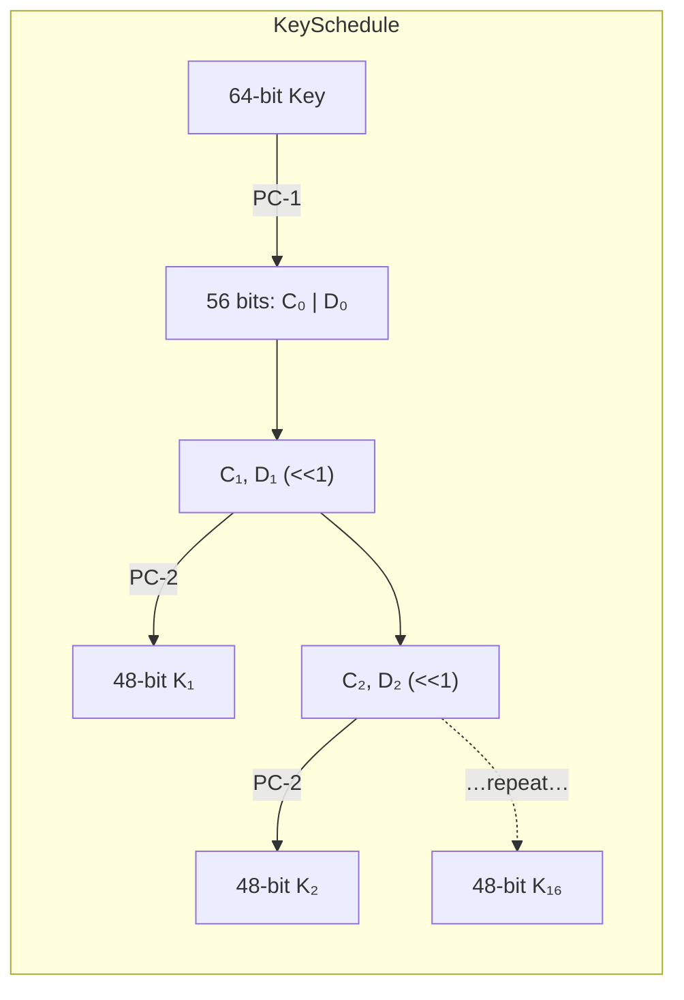
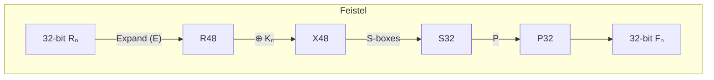
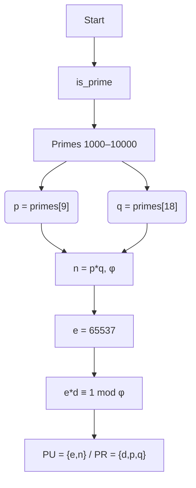

# cs7349-001c-1252-final

## Install

1. **Clone the repo**  
   ```bash
   git clone https://github.com/GarrettGruss/cs7349-001c-1252-final.git
   cd cs7349-001c-1252-final
   ```

2. **Configure Poetry to create an in-project venv**  
   ```bash
   poetry config virtualenvs.in-project true
   ```

3. **Install dependencies**  
   ```bash
   poetry install
   ```

4. **Activate the virtual environment**  
   - **Unix / macOS**  
     ```bash
     source .venv/bin/activate
     ```
   - **Windows (PowerShell)**  
     ```powershell
     .\.venv\Scripts\Activate.ps1
     ```

## Usage

### DES demo

```bash
poetry run python -m cs7349_001c_1252_final.scripts.des
```
- Prompts “Hello, DES!” → encrypts with `b"secr3t_k"` → decrypts and prints result.

### RSA demo

```bash
poetry run python -m cs7349_001c_1252_final.scripts.rsa_crypto
```
- Interactive: primality test, key generation, encryption/decryption of an integer, and brute-force demonstration.

## Testing

- **Run all tests**  
  ```bash
  poetry run pytest
  ```
- **Verbose mode** (shows detailed logs)  
  ```bash
  poetry run pytest -v --log-cli-level=DEBUG
  ```


---

# Project Report

## Problem 1. Modern Symmetric Cipher & Decipher (DES)

### 1.1 Overview & Components

Implemented DES over 16 Feistel rounds. Major components:

1. **Bit/Byte Conversion**  
   - `bytes_to_bit_array(data: bytes) -> List[int]`  
   - `bit_array_to_bytes(bits: List[int]) -> bytes`

2. **Permutations**  
   - **Initial Permutation (IP)** and **Final Permutation (FP)**
   - **Expansion (E)**, **P-permutation (P)**  
   Implemented by `permute(bits, table)`.

3. **Key Schedule**  
   - PC-1 → split into C₀, D₀ (28 bits each)  
   - **Left shifts** per round (`SHIFT_SCHEDULE`)  
   - PC-2 → 48-bit subkey Kᵢ for i=1…16  



4. **Feistel Function `F(R, K)`**  
   - Expand 32 bits → 48 bits (`E`)  
   - XOR with subkey  
   - S-box substitution (8×6 → 8×4 bits)  
   - P-permutation  



### 1.2 Encryption / Decryption Flow

```mermaid
flowchart LR
  PLAINTEXT -->|"Pad to 8-byte blocks"| PADDED
  PADDED --> IP --> L0[32] & R0[32]
  loop 16 rounds
    direction LR
    Lₙ & Rₙ --> F = F(Rₙ, Kₙ)
    Rₙ₊₁ = Lₙ ⊕ F  
    Lₙ₊₁ = Rₙ
  end
  L16 & R16 --> Swap(R16|L16) --> FP --> CIPHERTEXT
```

- **Rounds**: 16  
- **Mode**: ECB (each 8-byte block independently)
- **Padding**: PKCS#5/P KCS#7 style  

### 1.3 Example

```python
>>> cipher = des_encrypt("Hello, DES!", b"secr3t_k")
>>> cipher
'8a1f3d4b2c...'
>>> des_decrypt(cipher, b"secr3t_k")
'Hello, DES!'
```

---

## Problem 2. RSA Crypto System

### 2.1 Prime Check & Key Generation

1. **Primality Test**  
   ```python
   def is_prime(n: int) -> bool
   ```
2. **Selecting p, q**  
   - Find all primes in [1000…10000]  
   - Choose 10ᵗʰ (`p`) and 19ᵗʰ (`q`)  

3. **Compute**  
   ```
   n = p * q
   φ = (p – 1)*(q – 1)
   e = 65537   (fallback to 3,5… if gcd(e,φ)≠1)
   d = modinv(e, φ)
   ```
4. **Public Key** PU = {e, n}  
   **Private Key** PR = {d, p, q}



### 2.2 Encrypt/Decrypt & Test “rsa”

- **Mapping**:  
  `r→17, s→18, a→0`  
- **Encrypt** `c = m^e mod n`  
- **Decrypt** `m = c^d mod n`

```python
for ch in "rsa":
    m = ord(ch) - ord('a')
    c = encrypt(m, e, n)
    m2 = decrypt(c, d, n)
    assert m2 == m
```

### 2.3 Brute-Force Private Key

```mermaid
flowchart LR
  PUB[e,n] --> factor[n] --> find p,q
  p,q --> φ
  φ --> search[d] (2…φ) → check (e*d mod φ == 1)
  → d_found
```
- **Timing**: measured via `time.perf_counter()`  
- **Demo**: prints seconds elapsed for exhaustive search.

---

## Observations & Conclusions

- **DES**: 16 rounds, ECB mode, full bit-level implementation.  
- **RSA**: deterministic small‐prime keygen is insecure; real systems use random large primes + Miller–Rabin.  
- **Brute-force**: trivial for small `n`, infeasible for real 2048-bit RSA.